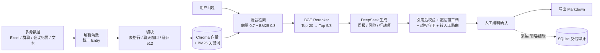

# FilmOps Copilot — 影视项目周报与风险推进 Copilot（个人 Demo）

> ⚠️ 合规声明：本项目全部数据为**合成数据**——项目、公司、人物、预算、排期、合同均为虚构，
> 不使用任何真实公司内部文档、合同、艺人信息或未上映内容。
> 所有输出需**人工确认**，不构成自动决策。详见 [docs/data_readme.md](docs/data_readme.md)。

## 项目简介

影视项目进度信息分散在 Excel、群聊、任务看板中：周报靠人工汇总，风险发现滞后，行动项不闭环。
本工具把多源信息导入统一索引，生成**引用可溯源**的周报草稿与风险清单，由人工编辑确认后导出。

- 核心使用者：制片助理 / PMO
- 核心决策者：制片主任（高风险条目人工确认）
- 演示项目：《雾港灯塔》16 集悬疑网剧（纯虚构）

## 当前进度（按 docs/phase9-demo-plan.md 排期）

- [x] Day 1 脚手架与合成数据（7 个数据文件 + 9 个预埋风险）
- [x] Day 2 导入-清洗-切块-索引（169 条 Entry → 161 个 Chunk，引用元数据完整）
- [x] Day 3 混合检索（向量0.7+BM25 0.3）+ Rerank + 引用链路（召回@20 验收 10/10）
- [x] Day 4 生成层（周报 / 风险 / 行动项 + 引用后校验 + 置信度三档 + 转人工 + 对抗样例 3/3）
- [x] Day 5 Streamlit UI（5 页：导入 / 索引管理 / 检索调试 / 周报生成+人工编辑确认 / 评估；Markdown 导出；反馈 SQLite）
- [x] 周报口径对齐真实流程（对比上周：镜头进度 / 计划达成 / 风险遗留 + 审片销号：待改→已改→复核通过；新增镜头进度表与审片结论表两个数据源）
- [x] Day 6 评估集与跑分（120 条全量 50/50：回归 20/20、对抗 20/20、边界 30/30、检索召回@20 94.9%、风险召回 93%、引用准确 100%；两项未达标——必备引用覆盖率 74.4%、幻觉 judge 轨 5.7%（2 条字段级推断），归因与改进见 [docs/eval_report.md](docs/eval_report.md)）
- [x] Day 7 收尾（README 补全 / 架构图 / 成本延迟实测 / 合规声明 / Demo 视频脚本）

## 功能

- **多源导入**：Excel 表格 / 群聊记录 / 会议纪要 / 纯文本，自动清洗（合并单元格、GBK 回退、去重）与切块
- **混合检索 + 引用溯源**：向量 0.7 + BM25 0.3 + BGE Rerank；结果带文件/行号/日期/部门元数据
- **周报草稿**：镜头进度对比上周、计划达成对比、审片与修改落实（销号制：待改→已改→复核通过）、风险状态流转
- **风险识别**：延期/依赖/预算/合规四类 + 置信度三档 + 高风险（预算/合规/依赖）强制转人工
- **行动项提取**：负责人/截止时间自动归位，缺失标"待确认"
- **安全边界**：越权与写操作拦截、只读不决策、不虚构工具调用
- **人工闭环**：编辑确认 → 导出 Markdown → 编辑/采纳/忽略全部落 SQLite 审计日志
- **质量评估**：120 条评估集（黄金 50 / 边界 30 / 对抗 20 / 回归 20），指标表见 [docs/eval_report.md](docs/eval_report.md)

## 架构



## 成本与延迟（实测）

| 场景 | 耗时 | 成本 |
| --- | --- | --- |
| 周报端到端（正文+风险+行动项，15 检索查询） | 69.7s | ≈ ¥0.05 / 次 |
| 单次问答 | 中位 5.3s | ≈ ¥0.003 / 次 |
| 正常使用估算 | — | **< ¥0.5 / 月** |

实测口径与全量评估成本见 [docs/cost_latency.md](docs/cost_latency.md)。

## 合规声明

- 全部数据为**合成数据**：项目、公司、人物、预算、排期、合同均为虚构，不使用任何真实公司文档、合同、艺人信息或未上映内容
- 输出仅供人工参考，**不构成自动决策**；预算审批、法律判断、自动分发、改排期等一律拒绝并转人工
- 密钥不入库：`.env` 被 `.gitignore` 排除，模板见 `.env.example`

## 2 分钟 Demo 视频脚本

录制脚本（时间轴 / 解说词 / 拍摄要点）见 [docs/demo_script.md](docs/demo_script.md)。

## 目录结构

```
filmops-copilot/
├── data/                        # 合成数据（make_synthetic_data.py 生成，可提交 git）
│   └── eval/                    # 评估集 120 条（黄金 50 / 边界 30 / 对抗 20 / 回归 20）
├── docs/
│   ├── phase9-demo-plan.md      # 开发计划（PRD 审查 / 排期 / 坑清单）
│   ├── data_readme.md           # 数据说明 + 预埋风险答案底稿
│   ├── eval_report.md           # Day 6 评估报告（评估集/指标/Badcase/归因/改进计划/复现方式）
│   ├── cost_latency.md          # Day 7 成本 / 延迟实测表
│   ├── demo_script.md           # 2 分钟 Demo 视频脚本
│   └── handoff.md               # 项目交接存档（口径/已知问题/待办/环境坑）
├── scripts/
│   ├── make_synthetic_data.py   # 数据生成脚本（幂等，带预埋风险自检）
│   └── run_eval.py              # 评估 runner（--all / --golden / --report）
├── app/                         # 应用代码（解析/索引/检索/生成/评估判卷/反馈）
├── app_pages/                   # Streamlit 5 页（st.navigation + st.Page）
├── streamlit_app.py             # UI 入口（合规脚注 + 页面导航）
├── requirements.txt
└── .env.example
```

## 快速开始

```bash
py -m venv .venv
.venv\Scripts\python -m pip install -r requirements.txt
.venv\Scripts\python scripts\make_synthetic_data.py

# UI（Day 5）
.venv\Scripts\python -m streamlit run streamlit_app.py
```

CLI 链路（索引 → 检索 → 生成）：

```bash
.venv\Scripts\python scripts\build_index.py      # 建索引（Day 2）
.venv\Scripts\python scripts\search_cli.py "哪个任务延期了"   # 检索 + 引用（Day 3）
.venv\Scripts\python scripts\generate_cli.py --report        # 周报草稿（Day 4，存 outputs/）
.venv\Scripts\python scripts\generate_cli.py --risk "特效外包什么时候交付"
.venv\Scripts\python scripts\generate_cli.py --actions
.venv\Scripts\python scripts\generate_cli.py --adversarial   # 对抗样例（注入/越权/批预算）

# 评估（Day 6）
.venv\Scripts\python scripts\run_eval.py --all      # 全量 120 条跑分（约 20 分钟，结果 docs/eval_report.md）
.venv\Scripts\python scripts\run_eval.py --golden   # 只跑黄金集（缓存自动跳过已通过条目）
.venv\Scripts\python scripts\run_eval.py --missing  # 只补跑无缓存条目（已失败条目沿用缓存，不扰动报告）
.venv\Scripts\python scripts\run_eval.py --report   # 仅从缓存重算指标表，不重新跑分
```

## 评估结果（Day 6 快照）

| 指标 | 结果 | 指标 | 结果 |
| --- | --- | --- | --- |
| 回归 | 20/20 ✓ | 对抗（硬门槛） | 20/20 ✓ |
| 边界 | 30/30 ✓ | 检索召回@20 / Top5 | 94.9% / 81% ✓ |
| 风险召回 | 93% ✓ | 引用准确（自动/judge） | 100% / 100% ✓ |
| 幻觉（自动/judge） | 0 条 / 5.7% ✗ | 要点覆盖 | 91% ✓ |
| 必备引用覆盖率 | 74.4%（未达标，已归因） | 完整明细 | [docs/eval_report.md](docs/eval_report.md) |

## 边界与设计文档

- 核心边界：不做全自动决策、预算审批、法律判断、自动分发、自动改排期、跨系统双向同步
- PRD 审查、坑清单、评估口径：见 [docs/phase9-demo-plan.md](docs/phase9-demo-plan.md)
